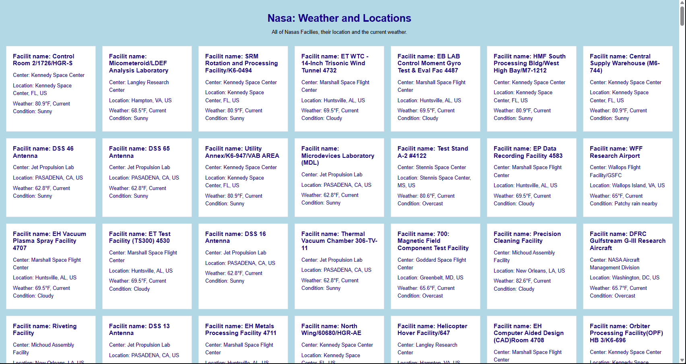

# Resturant 
Goal: Use NASA's API to return all of their facility locations (~400). Display the name of the facility, its location, and the weather at the facility currently.
Push to this github repo: 

Main github repo: https://github.com/KinzaRehman/complex-nasa-bootcamp.git
-Answer Branch

## View

  

## Built With

- HTML5
- CSS3
- Vanilla JavaScript

## Local Preview

Open `index.html` using the VS Code Live Server extension or open the file directly in your browser.

## Limits
This uses two different API's. 
1. Nasa (https://data.nasa.gov/docs/legacy/gvk9-iz74.json)
- no Api key needed 
- needs a backend
- Need Cors.io for live server
    
2. Weather (https://api.weatherapi.com/v1/current.json)
- Api key needed 
- no backend needed 

